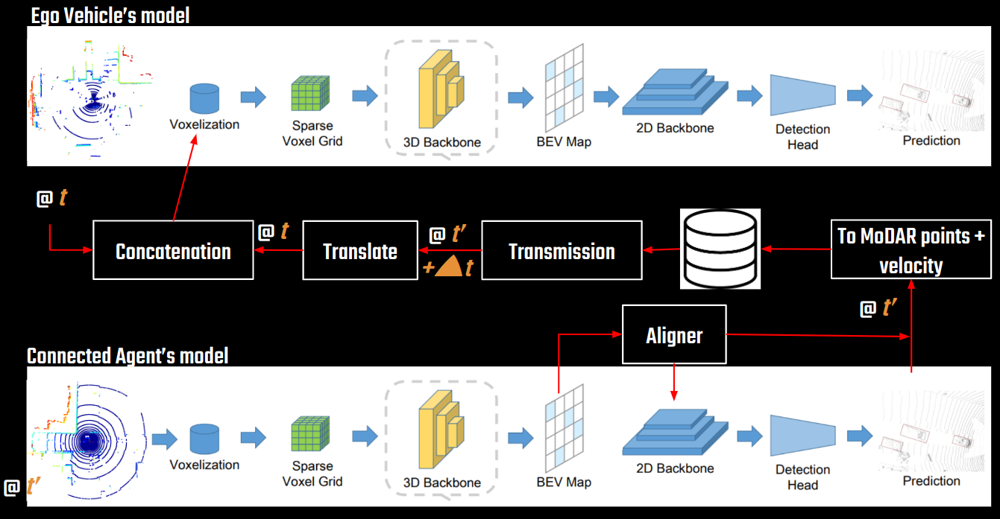

# Practical Collaborative Percpetion

This is the official code release for **Practical Collaborative Perception: A Framework for Asynchronous and Multi-Agent 3D Object Detection**

We propose a new framework for collaborative 3D object detection named *lately* fusion that takes objects detected by other connected agents, 
including connected autonomous vehicles (CAV) and intelligent roadside units (IRSU), and fuse them with the raw point cloud of the ego vehicle.
Our method is the combination of *late* fusion that exchanges connected agents' output (i.e., detected objects) and ear*ly* fusion that fuses 
exchanged information at the input of the ego vehicle, thus its name *lately*.

<p align="center">
  
</p>

The fusion at the input of the ego vehicle is done using [MoDAR](https://arxiv.org/abs/2306.03206).
In details, objects detected by other connected agents are interpreted into 3D points with addition features (e.g., objects' dim, class, 
confident score).
Then, these interpreted 3D points, which are referred to as *MoDAR* points, are transformed to the ego vehicle's frame where they are concatenated
with the raw point cloud obtained by the ego vehicle.

To account for the asynchronization among connected agents, each detected object is assigned a predicted velocity so that they can be propagated
from the timestep when it was detected to the timestep that is queried by the ego vehicle.
This velocity prediction is based on scene flow predicted by our previous work called [Aligner](https://arxiv.org/abs/2305.02909).

Compared to the other collaboration frameworks, including early fusion, late fusion, mid fusion, our method has the following advantages:
- achieving competitive performance with respect to early fusion (99% of early fusion's mAP in V2X-Sim dataset)
- not requiring that connected agents are in sync
- consuming as much bandwidth as late fusion
- requiring minimal changes made to single-agent detection models
- straightforwardly supporting heterogeneous networks of detection models 

Results of experiments on the [V2X-Sim dataset](https://ai4ce.github.io/V2X-Sim/) to compare our method against other collaboration method in 
both syncrhonous (agents obtain and process point cloud at the same time) and asynchronous setting 
(0.2 seconds latency between the ego vehicle and others) are shown in the table below

|Colab Method           | Sync (mAP) | Async (mAP) | Bandwidth Usage (MB) | Weight |
| -----           | :-----:| :--------: | :-----: | :-----: | 
| [None](tools/cfgs/v2x_sim_models/v2x_pointpillar_basic_car.yaml)  | 52.84  | -      | 0      | [pillar_car](https://uncloud.univ-nantes.fr/index.php/s/rZcDaP4GEZPaJ2q) |
| [Late](tools/cfgs/v2x_sim_models/v2x_late_fusion.yaml)            | 70.48  | 67.80  | 0.01   | - |
| [Mid-DiscoNet](tools/cfgs/v2x_sim_models/v2x_pointpillar_disco.yaml)            | 78.70  | 73.10  | 25.16   | [pillar_mid_sync](https://uncloud.univ-nantes.fr/index.php/s/FXN7ciHzXDazjNB)|
| [Early](tools/cfgs/v2x_sim_models/v2x_pointpillar_basic_ego_early.yaml)            | 78.10  | 77.30  | 33.95   | [pillar_early_sync](https://uncloud.univ-nantes.fr/index.php/s/WXrSCRjiSw7RxYL) |
| [Ours](tools/cfgs/v2x_sim_models/v2x_pointpillar_basic_ego.yaml)            | 79.20  | 76.72  | 0.02   | [pillar_colab_async](https://uncloud.univ-nantes.fr/index.php/s/4rPJ2T7Q3STAw6T) |

Qualitative result on the V2X-Sim dataset

<p align="center">
  
</p>


## Overview
1. [Getting Started](#getting-started)
2. [Qualitative Result](#qualitative-result)
3. [Reproduce Our Result](#reproduce-our-result)
4. [Citation](#citation)

## Getting Started
### Installation
Our codebase is based on [OpenPCDet](https://github.com/open-mmlab/OpenPCDet). 
Please refer to their [installation instruction](https://github.com/open-mmlab/OpenPCDet/blob/master/docs/INSTALL.md) for setting OpenPCDet.

Our models use dynamic voxelization provided by [torch_scatter](https://github.com/rusty1s/pytorch_scatter)
```shell
pip install torch-scatter -f https://data.pyg.org/whl/torch-1.12.0+cu116.html
```
Please modify the version of PyTorch and CUDA according to your machine.

To interface with the V2X-Sim dataset, please install `nuscenes-devkit`

```shell
pip install nuscenes-devkit==1.1.9
```

### Get The Data
We use **V2X-Sim 2.0** for our experiment. 
This dataset can be downloaded [here](https://drive.google.com/drive/folders/1nVmY7g_kprOX-I0Bqsiz6-zdJM-UXFXa).
As our models use only point clouds, the download of the full dataset is unnecessary.
The zip files that are required are
- v2.0.zip
- lidar1.zip
- lidar2.zip
- lidar3.zip
- maps.zip

Let the following environment variables representing the directory of OpenPCDet and V2X-Sim dataset
```shell
DIR_OpenPCDet=/home/workspace/OpenPCDet

DIR_V2X=$DIR_OpenPCDet/data/v2x-sim/v2.0-trainval/
```

Please unzip the downloaded files into `$DIR_V2X`. 
The directory structure should look like
```shell
$DIR_V2X
├── maps
├── sweeps
└── v2.0-trainval
    └──*.json
```
If you don't download *lidarseg.zip*, please remove *$DIR_V2X/lidarseg.json* to avoid error when 
loading the dataset using nuscenes-devkit.

## Qualitative Result
To use our models in inference mode, please download the following models
- PointPillar for connected vehicles [here](https://uncloud.univ-nantes.fr/index.php/s/rZcDaP4GEZPaJ2q)
- SECOND for IRSU [here](https://uncloud.univ-nantes.fr/index.php/s/cKc8ttTLNfzntPr)
- Collaborative model based on PointPillar backbone for the ego vehicle [here](https://uncloud.univ-nantes.fr/index.php/s/3yHcp9BnrS49eso)

and place them in `$DIR_OpenPCDet/tools/pretrained_models`

The prediction of a scene of V2X-Sim dataset is generated and visualized sample-by-sample by

```shell
cd $DIR_OpenPCDet/workspace

python visualize_collab.py --scene_idx 0
```

Note that this visualization can be run on the **mini** partition of V2X-Sim as well. 
If this is what you want, please unzip the mini partition of V2X-Sim to `$DIR_V2X`and replace `trainval` in the line 29 of 
`$DIR_OpenPCDet/workspace/visualize_collab.py` with `mini`.

## Reproduce Our Result

If you just want to evaluate our models, you can skip the training of single-agent models and collaborative model.
The weights of these models are provided [here](https://uncloud.univ-nantes.fr/index.php/s/ecQjo9NfxiQQXGS) (or in the table above).
Please download them and put them in `$DIR_OpenPCDet/tools/pretrained_models`.

### Prepare V2X-Sim dataset for training

To parse data of the roadside unit for training and evaluation

```shell
cd $DIR_OpenPCDet

python -m pcdet.datasets.nuscenes.v2x_sim_dataset --create_v2x_sim_rsu_infos --training --version v2.0-trainval
```
After this command was executed, you should find two files *full_v2x_sim_infos_10sweeps_train.pkl, full_v2x_sim_infos_10sweeps_val.pkl*
in `$DIR_V2X`

To parse data of the connected vehicles for training and evaluation
```shell
cd $DIR_OpenPCDet

python -m pcdet.datasets.nuscenes.v2x_sim_dataset_car --create_v2x_sim_car_infos --version v2.0-trainval
```
The outpuf of this command are *full_v2x_sim_car_infos_10sweeps_train.pkl, full_v2x_sim_car_infos_10sweeps_val.pkl* which are also stored 
in `$DIR_V2X`.

### Train Single-agent Model
All trainings in this section is done on one NVIDIA RTX A6000 GPU.

To train detection model of the road-side unit
```shell
cd $DIR_OpenPCDet/tools

python train.py --cfg_file cfgs/v2x_sim_models/v2x_pointpillar_basic_rsu.yaml --batch_size 4 --workers 0 --epochs 20
```

To train detection model of connected vehicles
```shell
cd $DIR_OpenPCDet/tools

python train.py --cfg_file cfgs/v2x_sim_models/v2x_pointpillar_basic_car.yaml --batch_size 2 --workers 0 --epochs 20
```

### Generate Exchange Database
After finished training single-agent models for IRSU and CAV, the resulting models are used to generate database of exchanged *MoDAR* points
to train the collaborative model used by the ego vehicle.

You can skip this step by downloading the database we generated [here](TODO)

Copy weights of trained single-agent models
```shell

DIR_OUTPUT=$DIR_OpenPCDet/output/v2x_sim_models

cp $DIR_OUTPUT/v2x_pointpillar_basic_rsu/default/ckpt/checkpoint_epoch_20.pth $DIR_OpenPCDet/tools/pretrained_models/v2x_pointpillar_basic_rsu_ep20.pth

cp $DIR_OUTPUT/v2x_pointpillar_basic_car/default/ckpt/checkpoint_epoch_19.pth $DIR_OpenPCDet/tools/pretrained_models/v2x_pointpillar_basic_car_ep19.pth
```

Generate exchange database
```shell
cd $DIR_OpenPCDet/workspace

python v2x_gen_exchange_database.py --model_type car --ckpt_path ../tools/pretrained_models/v2x_pointpillar_basic_car_ep19.pth --training 1

python v2x_gen_exchange_database.py --model_type car --ckpt_path ../tools/pretrained_models/v2x_pointpillar_basic_car_ep19.pth --training 0

python v2x_gen_exchange_database.py --model_type rsu --ckpt_path ../tools/pretrained_models/v2x_pointpillar_basic_rsu_ep20.pth --training 1

python v2x_gen_exchange_database.py --model_type rsu --ckpt_path ../tools/pretrained_models/v2x_pointpillar_basic_rsu_ep20.pth --training 0
```

### Train Collaborative Model
This training is done on one NVIDIA RTX A6000 GPU.

```shell
cd $DIR_OpenPCDet/tools
python train.py --cfg_file cfgs/v2x_sim_models/v2x_pointpillar_basic_ego.yaml --batch_size 4 --workers 0
```

### Evaluate Collaborative Model
```shell
cd $DIR_OpenPCDet/tools

cp $DIR_OUTPUT/v2x_pointpillar_basic_ego/default/ckpt/checkpoint_epoch_20.pth $DIR_OpenPCDet/tools/pretrained_models/v2x_pointpillar_lately.pth

python test.py --cfg_file cfgs/v2x_sim_models/v2x_pointpillar_basic_ego.yaml --batch_size 8 --workers 0 --ckpt pretrained_models/v2x_pointpillar_lately.pth
```

## Citation
```
@article{dao2023practical,
  title={Practical Collaborative Perception: A Framework for Asynchronous and Multi-Agent 3D Object Detection},
  author={Dao, Minh-Quan and Berrio, Julie Stephany and Fr{\'e}mont, Vincent and Shan, Mao and H{\'e}ry, Elwan and Worrall, Stewart},
  journal={arXiv preprint arXiv:2307.01462},
  year={2023}
}
```